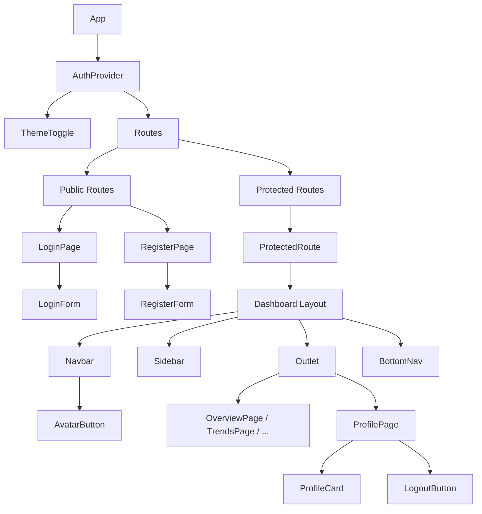

## Context

StudyPal 当前是纯前端应用，所有路由（`/overview`、`/recommendations`、`/trends`、`/goals`、`/chat`）均无需认证即可访问。后端 auth API spec 已定义（`openspec/specs/auth/spec.md`），但实际后端尚未实现。前端需要先以 mock 模式建立认证流程，后续无缝切换至真实 API。

技术栈：React 19 + React Router v7 + TypeScript + Tailwind CSS v4。

## Goals / Non-Goals

**Goals:**
- 实现登录/注册页面与表单（独立全屏布局，不套 Dashboard 壳）
- 实现 AuthContext 状态管理，含 localStorage 持久化
- 实现 ProtectedRoute 鉴权守卫
- 实现 Profile 页面（头像、连续学习天数、用户等级、学习统计、退出登录）
- Navbar 右侧集成用户头像入口
- Mock 模式：localStorage 模拟用户数据库，service 层接口对齐后端 spec，联调时替换实现即可

**Non-Goals:**
- 不实现后台管理功能
- 不实现密码重置、邮箱验证、OAuth 第三方登录
- 不修改后端 auth spec
- 不引入外部认证库（如 NextAuth、Auth0）

## Decisions

### 1. 路由分层：公开路由 vs 受保护路由

**方案**：在 `App.tsx` 中拆分为两组 `<Route>`—— 不套 Dashboard 壳的公开路由（`/login`、`/register`）和套 Dashboard 壳的受保护路由（通过 `ProtectedRoute` 包裹）。

**替代方案考虑**：在 Dashboard 组件内判断登录态 → 拒绝，因为登录页不应出现 Sidebar/BottomNav。

### 2. AuthContext 结构

**方案**：使用 React Context + useReducer 管理状态，初始化时检查 localStorage 恢复 session。

```typescript
interface AuthState {
  user: User | null;
  accessToken: string | null;
  refreshToken: string | null;
  isAuthenticated: boolean;
  isLoading: boolean; // 初始化检查 localStorage 期间
}

interface AuthActions {
  login(username: string, password: string): Promise<void>;
  register(username: string, email: string, password: string): Promise<void>;
  logout(): void;
  refreshAccessToken(): Promise<void>;
}
```

**替代方案考虑**：Redux / Zustand → 拒绝，当前项目规模不需要额外状态库，Context 足够。

### 3. localStorage 持久化

**方案**：token 和 user 信息存入 localStorage，刷新页面自动恢复登录态。key 设计：

| key | 内容 |
|-----|------|
| `studypal_mock_users` | `MockUser[]`（所有注册用户记录） |
| `studypal_session` | `{ userId, accessToken, refreshToken }` |

初始化时读取 `studypal_session` → 校验 token → 恢复 user 状态。mock 模式下 token 为 base64 编码的假 JWT（不带真实签名），仅用于模拟过期逻辑。

### 4. authService 服务层

**方案**：独立的 service 模块，接口签名完全对齐后端 spec。mock 模式操作 localStorage，联调时替换为 `fetch()` 调用。

```
src/services/authService.ts
  ├── Mock 模式: localStorage CRUD
  └── API 模式 (联调): fetch() → FastAPI
```

切换方式：环境变量或配置常量控制 `USE_MOCK` 开关。

### 5. 组件层级



**文件清单**：

| 文件 | 类型 | 说明 |
|------|------|------|
| `src/context/AuthContext.tsx` | 新建 | 认证状态管理 |
| `src/services/authService.ts` | 新建 | API 服务层（mock/real 切换） |
| `src/mock/auth.ts` | 新建 | mock 用户数据与工具函数 |
| `src/components/auth/ProtectedRoute.tsx` | 新建 | 鉴权路由守卫 |
| `src/components/auth/LoginForm.tsx` | 新建 | 登录表单 |
| `src/components/auth/RegisterForm.tsx` | 新建 | 注册表单 |
| `src/components/profile/ProfileCard.tsx` | 新建 | 头像+等级+连续天数卡片 |
| `src/components/profile/LogoutButton.tsx` | 新建 | 退出登录按钮 |
| `src/pages/LoginPage.tsx` | 新建 | 登录页（全屏布局） |
| `src/pages/RegisterPage.tsx` | 新建 | 注册页（全屏布局） |
| `src/pages/ProfilePage.tsx` | 新建 | 个人中心页 |
| `src/App.tsx` | 修改 | 路由重构 |
| `src/components/Navbar/Navbar.tsx` | 修改 | 右侧头像区域 |
| `src/constants.ts` | 修改 | 新增路由常量和导航项 |

### 6. 对后端 auth API spec 的响应格式对齐

以下为 service 层必须对齐的接口定义（来自 `openspec/specs/auth/spec.md`）：

#### POST /api/auth/register

**Request**: `{ username: string, email: string, password: string }`
**Response 201**: `{ id: string, username: string, email: string, created_at: string }`
**Error 409**: `{ detail: "Username already taken" }` 或 `{ detail: "Email already registered" }`
**Error 422**: 字段级验证错误详情

#### POST /api/auth/login

**Request**: `{ username: string, password: string }`
**Response 200**: `{ access_token: string, refresh_token: string, token_type: "bearer", expires_in: 1800 }`
**Error 401**: `{ detail: "Invalid username or password" }`

#### POST /api/auth/refresh

**Request**: `{ refresh_token: string }`
**Response 200**: `{ access_token: string, token_type: "bearer", expires_in: 1800 }`
**Error 401**: `{ detail: "Invalid or expired refresh token" }` 或 `{ detail: "Refresh token has been revoked" }`

#### GET /api/users/me

**Request Header**: `Authorization: Bearer <access_token>`
**Response 200**: `{ id: string, username: string, email: string, avatar: string | null, streak_days: number, level: number, created_at: string }`
**Error 401**: `{ detail: "Not authenticated" }` 或 `{ detail: "Token has expired" }`

## Risks / Trade-offs

- **[Risk] Mock 模式 token 无真实签名** → 联调时后端校验必然失败。Mitigation：authService 切换 API 模式后，token 由服务端签发，前端不再伪造。
- **[Risk] localStorage 存储 token 存在 XSS 风险** → 当前阶段可接受（无后端真实数据）。Mitigation：联调阶段考虑 access token 仅存内存、refresh token 用 httpOnly cookie。
- **[Risk] 未登录时 Navbar 头像区域为空白** → 若体验不佳，后续可增加"登录"文字按钮作为 fallback。
- **[Trade-off] 无路由懒加载** → 认证相关页面体积较小，不影响首屏性能目标，暂不引入 `React.lazy`。

## Open Questions

<!-- 探索阶段已明确所有关键决策，暂无待解决问题 -->
